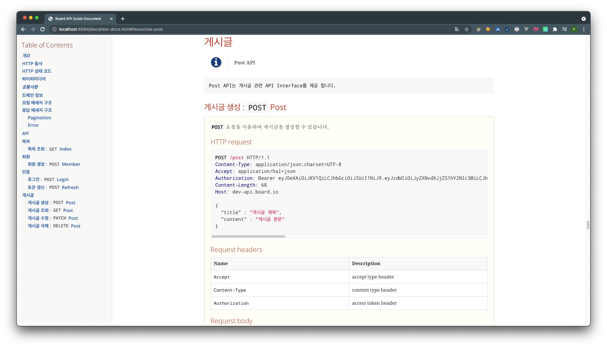
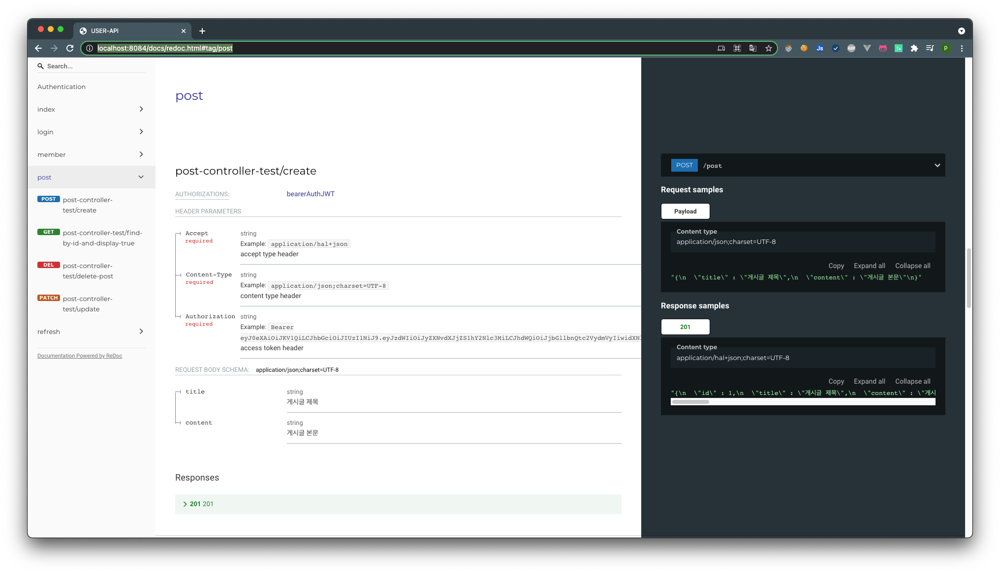

Java Board Project
===
> Basic CURD example with spring boot
> > JPA, spring-security, spring-hateoas, spring-rest-docs
---

## Run test cases and extract test coverage

```gradle
./gradlew test
```

> Run junit Test cases with jacoco and test coverage result report by html


- reports path : {your repository path}/build/reports/jacoco/test/html/index.html

---
## Generated API Docs with Spring REST Docs + OpenAPI3 + Redoc
```groovy
./gradle openapi3
```
> generate openapi3.yaml for OAS spec document

```groovy
npm install redoc-cli
```
> install with your run or ci environment

```groovy
cd {repository path}/build/api-spec
npx redoc-cli bundle openapi3.yaml
```
> export it to a static HTML file

What do you think useful as an API documentation tools
 - Spring REST Docs : http://localhost:8084/docs/rest-docs.html
   - 
 - OAS3 with Redoc : http://localhost:8084/docs/redoc.html
   - 
---

## Run build

```gradle
build : ./gradlew clean build
run : java -jar {your repository path}/build/libs/java-board-0.0.1-SNAPSHOT.jar
```

---

## Package structure

```
└─src
    ├─docs
    │  └─asciidoc : base api docs format
    ├─main
    │  ├─java
    │  │  └─io
    │  │      └─example
    │  │          └─board
    │  │              ├─advice
    │  │              │  └─exception : Global exception handler
    │  │              ├─config
    │  │              │  ├─application : Beans configurations required to run the spring application 
    │  │              │  ├─jpa : Data-jpa AuditorAware configurations
    │  │              │  ├─p6spy : JPA execute query print configurations
    │  │              │  ├─redis : Embedded redis configurations in local, test profiles
    │  │              │  └─security : Spring-security, java-jwt configurations
    │  │              │      ├─endpoint : Http Request security configurations
    │  │              │      └─jwt : jwt security configurations
    │  │              ├─controller : Request router
    │  │              ├─domain : Service domain model
    │  │              │  ├─dto : Data Transfer Object
    │  │              │  ├─rdb : JPA entity
    │  │              │  ├─redis : Redis entity
    │  │              │  └─vo : Value object
    │  │              ├─repository
    │  │              │  ├─rdb : Rdb connect interface
    │  │              │  └─redis : Redis connect interface
    │  │              ├─service : Business transaction 
    │  │              └─utils
    │  └─resources
    │      └─static
    │          └─docs : Generated api docs by spring-rest-docs
    └─test : application test cases
```